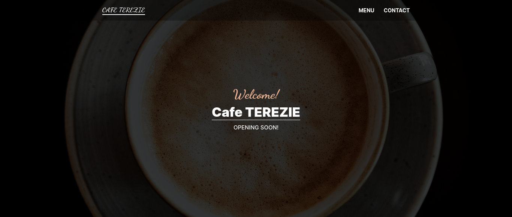

# Restaurant

> An implementation of a Single-Page Restaurant app.



## :tv: Media

[Live Demo Link](https://tereziz.netlify.app/)

## :toolbox: Tools & Technologies Used

### Built with

- HTML5
- CSS3
- JavaScript ES6
- webpack 5

## :rocket: Getting Started

To get a local copy up and running follow these simple example steps.

### Prerequisites

Install [Node.js with npm](https://nodejs.org/en/download/)

Install [webpack](https://webpack.js.org/guides/getting-started/)

### Set up

Clone repo into your local environment:

Clone with SSH

```git
git clone git@github.com:cliftondavies/Restaurant.git
```

Clone with HTTPS

```git
git clone https://github.com/cliftondavies/Restaurant.git
```

Open project directory

```bash
cd [your-directory-name]
```

Install packages:

```javascript
npm install
```

### Local Usage

#### In console

Start webpack:

```javascript
npm run watch
```

#### In Browser

Visit `http://localhost:3000/`.

## Author

👤 **Clifton Davies**

- Github: [@githubhandle](https://github.com/cliftondavies)
- Twitter: [@twitterhandle](https://twitter.com/cliftonaedavies)
- Linkedin: [linkedin](https://www.linkedin.com/in/clifton-davies-mbcs/)

## 🤝 Contributing

Contributions, issues and feature requests are welcome!

## Show your support

Give a ⭐️ if you like this project!

## Acknowledgements

- [Ultimate Addons](https://www.ultimatebeaver.com/restaurant-page-template/)
- [webflow Blog](https://webflow.com/blog/restaurant-website-design)
- [Justus Menke](https://unsplash.com/photos/47cW0To8dQY)
- [jojo (sharemyfoodd)](https://unsplash.com/photos/r4oekBkaF2Y)
- [Storiès](https://unsplash.com/photos/8b8k6AsNY6c)

## 📝 Copyright & License

Copyright (c) 2020 Clifton Davies.
This project is licensed under [MIT](https://opensource.org/licenses/MIT). See LICENSE file for details.
